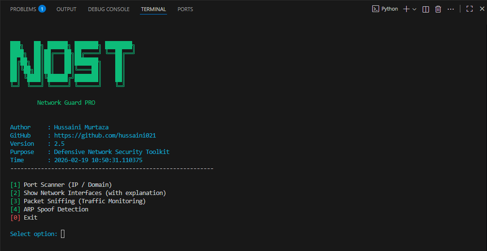

# 🔍 Network Analyzer

**Network Analyzer** is a professional Python-based network security and analysis tool designed for educational and defensive purposes.  
It helps users understand network behavior, identify exposed services, and detect common local network threats.

---

## 🚀 Features

### 🔹 1. Port Scanner (IP / Domain)
- Scans open TCP ports (1–1024)
- Supports both IP addresses and domain names
- Multi-threaded for improved performance
- Identifies exposed services and attack surfaces

### 🔹 2. Network Interface Analyzer
- Automatically detects available network interfaces
- Clearly explains each interface type:
  - Wi-Fi
  - Ethernet (LAN)
  - Mobile Data
  - Loopback (not recommended)
- Helps users choose the correct interface safely

### 🔹 3. Packet Sniffing (Traffic Monitoring)
- Monitors network traffic in educational/demo mode
- Requires selecting a valid network interface
- Useful for understanding packet flow and traffic behavior

### 🔹 4. ARP Spoof Detection
- Detects potential ARP Poisoning / MITM attacks
- Protects against fake gateway attacks
- Important for public and shared networks

---

## 🧠 What Is a Network Interface?

A **network interface** is the connection point between your system and the network.

Examples:
- `wlan0` → Wi-Fi
- `eth0` → Ethernet cable
- `rmnet_data0` → Mobile data (Termux)
- `lo` → Loopback (not useful for analysis)

This tool automatically lists and explains available interfaces.

---

## 🖥️ Installation

### ✅ Requirements
- Python 3.8 or higher
- Internet connection
- Administrator / Root privileges (recommended)

---

### 🐧 Linux

```bash
sudo apt update
sudo apt install python3 python3-pip git -y
git clone https://github.com/hussaini021/network-analyzer.git
cd network-analyzer
pip3 install -r requirements.txt
python3 network_guard_pro.py
🪟 Windows
Download Python from https://www.python.org/downloads/

Enable Add Python to PATH

Open Command Prompt

cmd
Copy code
git clone https://github.com/hussaini021/Network_Analyzer.git
cd Network_Analyzer
pip install -r requirements.txt
python run.py
📦 Python Dependencies
All required libraries are listed in requirements.txt.

text
Copy code
colorama
Built-in modules used:

socket

threading

os

time

datetime

📸 Screenshots
Create a folder named screenshots in the repository and add your images there.

Example usage in README:


## 📸 Screenshots

### Main Menu



⚠️ Disclaimer
This project is intended for educational and defensive security purposes only.

Do NOT use this tool on networks you do not own or have explicit permission to analyze.

The author is not responsible for misuse.

👤 Author
Hussaini Murtaza
GitHub: https://github.com/hussaini021

⭐ Support
If you find this project useful:

Star the repository

Share it on LinkedIn

Use it for learning and practice

